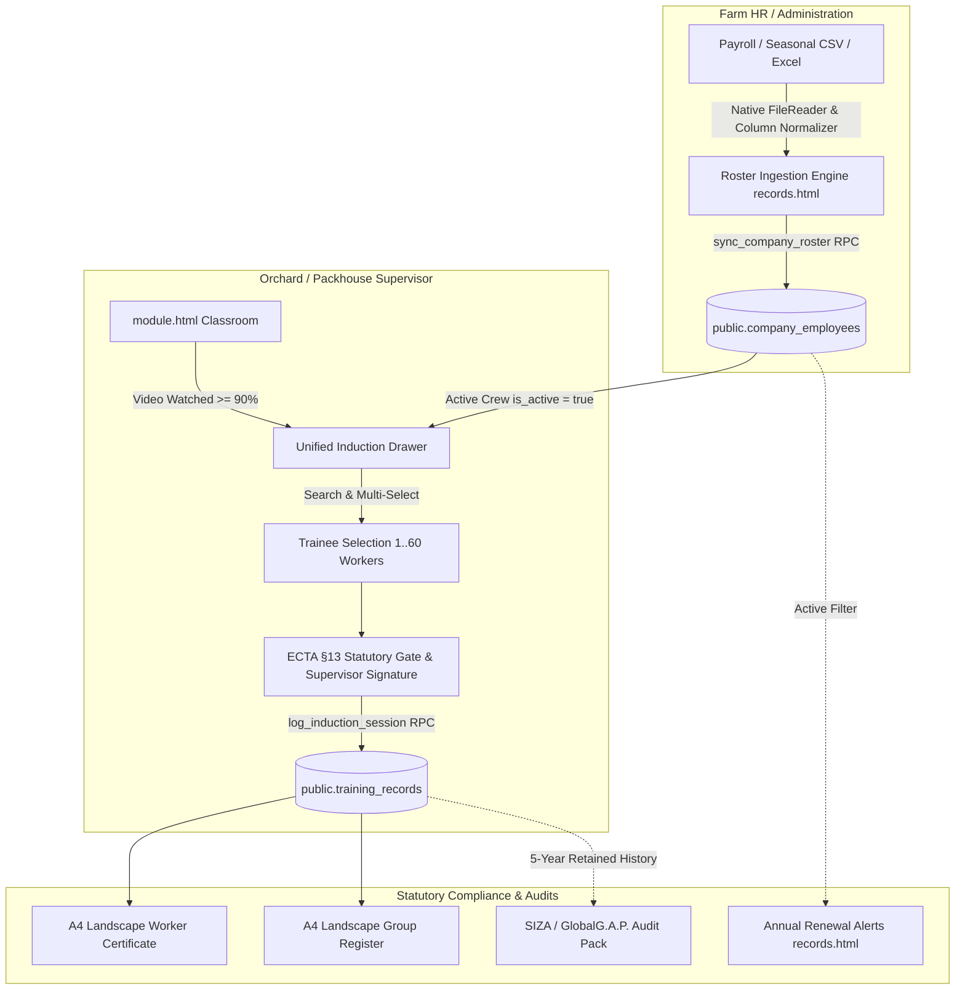
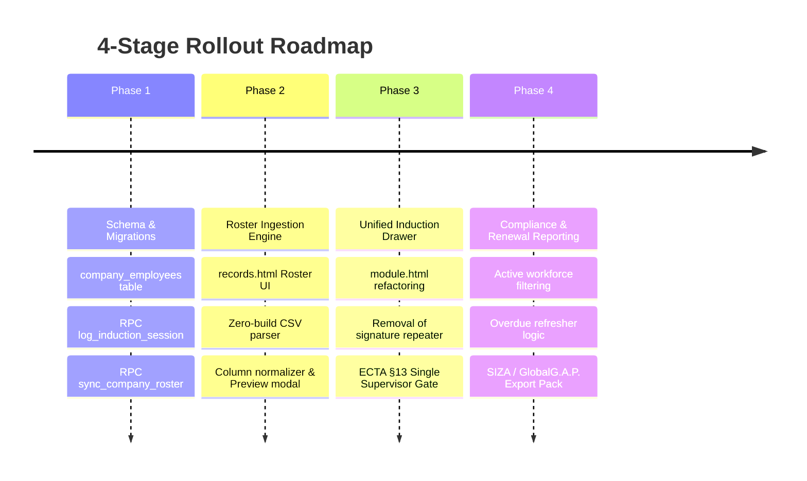

# Architectural & Schema Specification: Unified Induction Pipeline & Farm Employee Roster Engine

> **Document Type:** Production Architectural Blueprint & System Specification  
> **Status:** Approved / Specification Baseline  
> **Target Release:** Platform Core Induction Upgrade  
> **Subsystem Scope:** `module.html`, `records.html`, Supabase Database, Storage & Edge Infrastructure  
> **Database Baseline Reference:** [`.ai/SUPABASE_SCHEMA.md`](file:///home/luca/dev/the-vault-web/.ai/SUPABASE_SCHEMA.md) *(PostgreSQL 17.6 pg_dump manifest, synchronized 2026-10-02 08:46:11 UTC)*  
> **Compliance Benchmarks:** South African OHSA (Act 85 of 1993) §8 & §16(2), ECTA (Act 25 of 2002) §13, SIZA Social Standard v8 (Principle 4), GlobalG.A.P. IFA v6, POPIA (Act 4 of 2013) §14  

---

## 0. Database Baseline & Schema Manifest Cross-References

This specification directly bridges the application layer (`module.html`, `records.html`) with the authoritative database schema defined in [`.ai/SUPABASE_SCHEMA.md`](file:///home/luca/dev/the-vault-web/.ai/SUPABASE_SCHEMA.md).

### 0.1 Current Schema Analysis (`training_records`)
In [`.ai/SUPABASE_SCHEMA.md#L969-L985`](file:///home/luca/dev/the-vault-web/.ai/SUPABASE_SCHEMA.md#L969-L985), `public.training_records` is structured as follows:
```sql
CREATE TABLE public.training_records (
    id uuid DEFAULT gen_random_uuid() NOT NULL,
    created_at timestamp with time zone DEFAULT now(),
    company_id uuid,
    employee_name text NOT NULL,
    module_title text NOT NULL,
    completed_at date DEFAULT CURRENT_DATE NOT NULL,
    status text DEFAULT 'Verified'::text NOT NULL,
    supervisor_name text,
    signature_url text,
    training_type text DEFAULT 'Individual'::text,
    employee_number text,
    gender text,
    batch_session_id uuid,
    supervisor_signature_data text,
    employee_signature_data text
);
```
- **Primary Key:** `training_records_pkey` on `(id)` ([`.ai/SUPABASE_SCHEMA.md#L1358-L1359`](file:///home/luca/dev/the-vault-web/.ai/SUPABASE_SCHEMA.md#L1358-L1359)).
- **Foreign Key:** `training_records_company_id_fkey` referencing `public.companies(id) ON DELETE CASCADE` ([`.ai/SUPABASE_SCHEMA.md#L1589-L1590`](file:///home/luca/dev/the-vault-web/.ai/SUPABASE_SCHEMA.md#L1589-L1590)).
- **Row Level Security Policies:**
  - `INSERT`: `"Users can insert company training records"` ([`.ai/SUPABASE_SCHEMA.md#L1742-L1745`](file:///home/luca/dev/the-vault-web/.ai/SUPABASE_SCHEMA.md#L1742-L1745)):
    `WITH CHECK ((company_id IN (SELECT profiles.company_id FROM public.profiles WHERE (profiles.id = auth.uid()))))`
  - `SELECT`: `"Users can view company training records"` ([`.ai/SUPABASE_SCHEMA.md#L1831-L1834`](file:///home/luca/dev/the-vault-web/.ai/SUPABASE_SCHEMA.md#L1831-L1834)):
    `USING ((company_id IN (SELECT profiles.company_id FROM public.profiles WHERE (profiles.id = auth.uid()))))`
- **Tenant Context Helper:**
  `public.get_my_company_id()` returns `uuid` as a `STABLE SECURITY DEFINER` function ([`.ai/SUPABASE_SCHEMA.md#L165-L172`](file:///home/luca/dev/the-vault-web/.ai/SUPABASE_SCHEMA.md#L165-L172)).

### 0.2 Downstream Schema Impacts & Correction of Legacy Workforce Workaround
1. **Supply Chain View (`partner_supply_chain_metrics`)**:
   Defined in [`.ai/SUPABASE_SCHEMA.md#L992-L1015`](file:///home/luca/dev/the-vault-web/.ai/SUPABASE_SCHEMA.md#L992-L1015). Aggregates `training_records tr` where `tr.completed_at >= (CURRENT_DATE - '90 days'::interval)`.
2. **Partner Portal RPC (`get_partner_portal_data`)**:
   Defined in [`.ai/SUPABASE_SCHEMA.md#L179-L310`](file:///home/luca/dev/the-vault-web/.ai/SUPABASE_SCHEMA.md#L179-L310).
   > [!NOTE]
   > **Legacy Bug Identified in Live Schema:** In [`.ai/SUPABASE_SCHEMA.md#L272-L276`](file:///home/luca/dev/the-vault-web/.ai/SUPABASE_SCHEMA.md#L272-L276), `w_stats.total_workforce` was calculated by querying `SELECT count(*) FROM public.profiles p WHERE p.company_id = c.id`. Because `profiles` represents authenticated manager logins (seat cap 1–8), this resulted in a false workforce count and forced the legacy fallback in line 238: `coalesce(w_stats.total_workforce, c.seat_limit, 10)`.
   >
   > The introduction of `public.company_employees` provides the true statutory workforce headcount ($N_{\text{active}}$) to replace this legacy workaround in `get_partner_portal_data`, giving corporate packhouses and commercial processors accurate SIZA/GlobalG.A.P. training ratios for their grower networks.

---

## Executive Summary & Architectural Rationale

Seasonal agricultural operations in South Africa (macadamia, banana, citrus, table grape, and avocado orchards and packhouses) operate under severe operational and statutory friction:
1. **The Signature Bottleneck:** Logging an induction for a picking gang of 20–60 workers currently forces supervisors to either run through 50 individual manual form entries or hand a phone/tablet across a dusty orchard for 50 repetitive canvas signatures. This creates extreme friction, queue fatigue, smudged inputs, and resistance to digital adoption.
2. **Statutory Misalignment:** Under **OHSA Section 8(2)(e)**, **General Safety Regulations 2(1)**, and **ECTA Section 13**, the legal duty to provide training, verify comprehension, and certify attendance rests squarely on the **Employer / Supervising Officer**. In standard agricultural practice (and statutory SIZA / GlobalG.A.P. audits), group inductions are legally certified by the **Supervising Officer’s sworn declaration and countersignature** against an attendance roster.
3. **Ghost Worker / Seasonal Churn Drift:** Without an authoritative farm employee roster, records are keyed by ad-hoc free-text strings (`employee_name`, `employee_number`). When seasonal workers leave at the end of a picking season, their records either clutter renewal registers as perpetual "overdue" warnings or risk being inappropriately purged—destroying statutory audit proof.

This specification establishes a **zero-build, roster-driven induction pipeline**:
- Ingests and maintains farm rosters in a multi-tenant `company_employees` table.
- Collapses individual and batch inductions into a **single, unified induction drawer** in `module.html`.
- Implements a **Single Supervisor Statutory Gate** using an atomic Supabase RPC that reduces network payload size by **over 95%**.
- Enforces **soft-deactivation** (`is_active = false`) for departed seasonal labor, maintaining complete 5-year statutory retention for SIZA/GlobalG.A.P. while filtering active workforce renewal alerts cleanly.



---

## 1. Unified Induction Flow (Merging Individual vs. Batch)

### 1.1 Problem & Current State Analysis
In `module.html`, the UI maintains an artificial mode toggle (`Individual` vs `Group`). 
- In **Individual** mode, managers fill out one worker code, name, gender, and open a secondary modal (`#workerSignModal`) for a canvas signature.
- In **Group** mode, managers must click "Add Another Worker" repeatedly and open the signature modal for every single trainee.
- On mobile devices in field conditions (sunlight, gloves, slow 3G/EDGE farm connections), this model fails.

### 1.2 Unified UI/UX Specification (`module.html`)
The separate "Individual" vs "Group" mode toggle is eliminated. A single **"Log Training Completion"** drawer opens with a two-phase interface:

```
+--------------------------------------------------------------------------+
| LOG TRAINING COMPLETION — [Module Title]                    [✕ Close]   |
+--------------------------------------------------------------------------+
| 📅 Date: 02 Oct 2026  |  Estate: Doveton Estate (Macadamia)              |
+--------------------------------------------------------------------------+
| STEP 1: SELECT TRAINEES FROM FARM ROSTER                                |
| [ 🔍 Search name, clock #, orchard... ] [ Filter: All Teams / Orchards ▾]|
|                                                                          |
| [ Select All Filtered (24) ] [ Clear Selection ]    Active Roster: 48    |
| +----------------------------------------------------------------------+ |
| | [✓] #P1042 — Sipho Sithole       | Orchard Team B | Male             | |
| | [✓] #P1043 — Nomvula Dlamini     | Orchard Team B | Female           | |
| | [ ] #P1048 — Blessing Moyo       | Pruning Gang 1 | Male             | |
| | [✓] #P1055 — Thabo Mokoena       | Orchard Team B | Male             | |
| +----------------------------------------------------------------------+ |
| Selected: 3 Trainees [Group Batch Mode Auto-Selected]                   |
| [+ Quick-Add Unlisted Guest Worker]                                      |
+--------------------------------------------------------------------------+
| STEP 2: STATUTORY SUPERVISOR VERIFICATION GATE (ECTA §13)               |
| Supervising Officer: [ Siyabonga Maseko                              ]  |
|                                                                          |
| [✓] MANDATORY ECTA SECTION 13 SUPERVISOR DECLARATION                     |
|     I, the undersigned Supervisor / Section 16(2) Appointee, formally   |
|     declare that the 3 selected workers physically attended this video   |
|     induction, were verbally assessed on the comprehension questions,   |
|     and on-site physical hazard controls have been verified.             |
|                                                                          |
| Supervisor Digital Signature Pad:                                        |
| +----------------------------------------------------------------------+ |
| | ~~~~~~~~~~~~~~~~~~~~~~~~ S. Maseko ~~~~~~~~~~~~~~~~~~~~~~~~~~~~~~~~~ | |
| +----------------------------------------------------------------------+ |
| [Clear Signature]                                                        |
+--------------------------------------------------------------------------+
| [ 🔒 DIGITALLY SIGN & RECORD 3 VERIFIED INDUCTIONS (BATCH) ]             |
+--------------------------------------------------------------------------+
```

### 1.3 Automatic Mode Resolution
The system dynamically computes the transaction metadata based strictly on selection count:
- **`selected_count === 0`**: Submit button is disabled (`cursor-not-allowed`, opacity 50%).
- **`selected_count === 1`**:
  - UI Badge: `Individual Worker Record`.
  - Stored `training_type = 'Individual'`.
  - Stored `batch_session_id = NULL`.
  - Generates standard 1-page Individual Training Certificate.
- **`selected_count > 1`**:
  - UI Badge: `Group Batch Session (${count} Trainees)`.
  - Stored `training_type = 'Batch'`.
  - Stored `batch_session_id = gen_random_uuid()` (shared across all records created in this execution).
  - Unlocks both the 2-page Group Attendance Register and individual worker certificates.

### 1.4 Single Supervisor Statutory Gate & Legal ECTA Section 13 Basis
- Under South African law, **ECTA (Act 25 of 2002) Section 13(2)** states that an electronic signature is not without legal force and effect merely on the grounds that it is in electronic format.
- For statutory agricultural training logs under **OHSA Section 8(2)(e)**, the employer is legally mandated to provide training and maintain an auditable register. The legal liability is shouldered by the **employer/supervisor**, not the laborer.
- **Elimination of Worker Signature Pad Repeater:**
  - Individual manual canvas signing by 50 seasonal workers is replaced by the **Supervisor Statutory Attestation**.
  - The supervisor acts as the certified statutory signatory, swearing under ECTA Section 13 that each listed worker was present, understood the video/language, and demonstrated comprehension.
  - The worker signature canvas repeater is completely removed from the batch flow, eliminating 90% of user friction.
  - *Fallback / Hybrid Capability:* If an individual certificate requires a physical mark for specific high-risk machinery (e.g. chainsaw, boiler), an optional individual worker signature pad can be opened on an individual record modal, but is no longer mandatory for standard group inductions.

### 1.5 Batch Constraint & Network Payload Analysis

#### Technical Payload Limit Evaluation:
In the legacy implementation, every record insert duplicates the base64 supervisor signature string (~20KB–35KB). Inserting 60 rows on the client currently generates:
$$\text{Payload} \approx 60 \times 35\,\text{KB} = 2.1\,\text{MB}$$
On rural 3G farm connections, sending a 2MB–3MB JSON POST over PostgREST frequently encounters connection resets, mobile browser timeouts, or HTTP 413 (Payload Too Large).

#### Architectural Solution — Atomic RPC Parameterization:
By routing through a dedicated PostgreSQL stored procedure `log_induction_session`, the supervisor signature is sent **exactly once**, regardless of batch size:
- Supervisor signature (1 base64 string): ~25 KB
- Trainee array (60 items with ID, Name, Number, Gender): ~4.5 KB
- Total JSON payload: **~29.5 KB** ($\approx 98.6\%$ payload reduction).

#### Statutory Batch Sizing Limits (SIZA & GlobalG.A.P.):
- **Auditor Credibility Rule:** Agricultural auditors (SIZA / GlobalG.A.P.) inspect induction registers for trainer-to-trainee ratios. A register containing 150 names signed off in a single 25-minute video session is immediately cited as an audit non-conformance (flagged as non-credible / ghost induction).
- **Enforced Architectural Constraints:**
  1. **Recommended Operational Cap:** **40–50 workers** per batch (standard orchard gang or packhouse line size).
  2. **Audit Warning Threshold:** If `selected_count > 50`, display an amber advisory:
     > *⚠️ Audit Advisory: SIZA / GlobalG.A.P. guidelines recommend group induction batches do not exceed 50 workers to ensure verifiable verbal comprehension.*
  3. **Hard System Cap:** **80 workers** per single logged session. If $> 80$, the UI disables the submit action and prompts the manager to split the crew into two sessions.

---

## 2. Farm Employee Roster Architecture & Ingestion

### 2.1 Database Schema Design: `public.company_employees`

A dedicated multi-tenant table is provisioned in Supabase, linked to `companies.id` with strict Row Level Security, following the PostgreSQL 17.6 DDL conventions in [`.ai/SUPABASE_SCHEMA.md`](file:///home/luca/dev/the-vault-web/.ai/SUPABASE_SCHEMA.md).

```sql
-- 1. Create company_employees table
CREATE TABLE public.company_employees (
    id uuid DEFAULT gen_random_uuid() NOT NULL,
    company_id uuid NOT NULL,
    employee_number text NOT NULL,
    first_name text NOT NULL,
    last_name text NOT NULL,
    id_passport_number text,
    gender text,
    team_or_orchard text,
    is_active boolean DEFAULT true NOT NULL,
    created_at timestamp with time zone DEFAULT timezone('utc'::text, now()) NOT NULL,
    updated_at timestamp with time zone DEFAULT timezone('utc'::text, now()) NOT NULL,
    CONSTRAINT company_employees_gender_check CHECK ((gender = ANY (ARRAY['Male'::text, 'Female'::text, 'Other'::text])))
);

-- 2. Constraints (Primary Key, Foreign Key & Unique Employee ID per Company)
ALTER TABLE ONLY public.company_employees
    ADD CONSTRAINT company_employees_pkey PRIMARY KEY (id);

ALTER TABLE ONLY public.company_employees
    ADD CONSTRAINT company_employees_company_id_fkey 
    FOREIGN KEY (company_id) REFERENCES public.companies(id) ON DELETE CASCADE;

ALTER TABLE ONLY public.company_employees
    ADD CONSTRAINT company_employees_company_id_employee_number_key 
    UNIQUE (company_id, employee_number);

-- 3. Performance & Multi-Tenant Query Indexes
CREATE INDEX idx_company_employees_company_active 
    ON public.company_employees USING btree (company_id, is_active);

CREATE INDEX idx_company_employees_company_team 
    ON public.company_employees USING btree (company_id, team_or_orchard);

CREATE INDEX idx_company_employees_search 
    ON public.company_employees USING btree (company_id, employee_number, first_name, last_name);

-- 4. Row Level Security (RLS)
ALTER TABLE public.company_employees ENABLE ROW LEVEL SECURITY;

-- Tenants can only view their own employees (Matching training_records policy pattern)
CREATE POLICY "Users can view company employees" 
    ON public.company_employees FOR SELECT 
    USING ((company_id IN (
        SELECT profiles.company_id 
        FROM public.profiles 
        WHERE (profiles.id = auth.uid())
    )));

-- Admins and Managers can mutate company employees
CREATE POLICY "Admins and Managers can mutate company employees" 
    ON public.company_employees FOR ALL 
    USING ((company_id IN (
        SELECT profiles.company_id 
        FROM public.profiles 
        WHERE (profiles.id = auth.uid()) 
          AND (lower(profiles.role) = ANY (ARRAY['master admin'::text, 'admin'::text, 'manager'::text, 'safety officer'::text]))
    )));
```

### 2.2 Updating `training_records` Table
To link training history with `company_employees` while preserving historical snapshot integrity:

```sql
-- Add employee_id foreign key with ON DELETE SET NULL
ALTER TABLE ONLY public.training_records 
    ADD COLUMN IF NOT EXISTS employee_id uuid;

ALTER TABLE ONLY public.training_records
    ADD CONSTRAINT training_records_employee_id_fkey 
    FOREIGN KEY (employee_id) REFERENCES public.company_employees(id) ON DELETE SET NULL;

CREATE INDEX idx_training_records_employee_id 
    ON public.training_records USING btree (employee_id);

CREATE INDEX idx_training_records_batch_session 
    ON public.training_records USING btree (batch_session_id);
```

> [!IMPORTANT]
> **Immutable Snapshot Principle**: `training_records` **must retain** its existing `employee_name`, `employee_number`, and `gender` columns as denormalized frozen snapshots ([`.ai/SUPABASE_SCHEMA.md#L973-L981`](file:///home/luca/dev/the-vault-web/.ai/SUPABASE_SCHEMA.md#L973-L981)). If an employee's surname changes or their roster profile is updated 2 years later, the historical statutory certificate must reflect the exact details under which the training was originally conducted and certified.

---

### 2.3 Roster Ingestion UX & Architecture

#### Location:
Integrated into `records.html` as a dedicated view toggle:
- `[ 📋 Training Records Register ]` vs `[ 👥 Farm Employee Roster ]`
- Includes a primary action button: `[ ⬆ Import Crew Roster (CSV) ]`.

#### Zero-Build Client-Side File Parsing Pipeline:
In compliance with the project's strict zero-build architecture (no Webpack, Vite, or npm packages), parsing runs purely in vanilla JavaScript using the native browser `FileReader` API.

1. **Format Support**: Standard CSV (RFC 4180 compliant) with comma, semicolon, or tab delimiters. For farm HR departments using Excel (`.xlsx`), the UI clearly instructs: *"Save your spreadsheet as CSV (Comma delimited) (*.csv) before uploading."*
2. **Flexible Header Alias Dictionary**:
   Farms use disparate payroll engines (Sage Pastel, VIP, PaySoft, AgriCol). The parser normalizes input headers to database keys:
   ```javascript
   const HEADER_ALIASES = {
     employee_number: ['employee_number', 'employee no', 'emp no', 'emp_no', 'clock no', 'clock #', 'worker id', 'id', 'persal', 'code', 'staff no', 'badge'],
     first_name: ['first_name', 'first name', 'firstname', 'given name', 'name', 'voornaam'],
     last_name: ['last_name', 'last name', 'lastname', 'surname', 'van', 'family name'],
     id_passport_number: ['id_passport_number', 'id number', 'id no', 'identity number', 'passport', 'id / passport', 'rsa id', 'id_no'],
     gender: ['gender', 'sex', 'geslag'],
     team_or_orchard: ['team_or_orchard', 'team', 'orchard', 'department', 'section', 'block', 'crew', 'division', 'gang', 'cost center']
   };
   ```
3. **Data Sanitization & Value Normalization**:
   - `gender`: Maps `'m'`, `'male'`, `'man'`, `'seun'` $\to$ `'Male'`; `'f'`, `'female'`, `'vrou'`, `'meisie'` $\to$ `'Female'`; defaults to `'Other'` or `NULL`.
   - `employee_number`: Uppercased, trimmed of non-alphanumeric whitespace.
   - `id_passport_number`: Strips spaces and hyphens; validates RSA ID checksum or foreign passport string length.

#### Pre-Commit Ingestion Modal:
Before committing data to the database, a verification modal displays:
- Total rows detected.
- Detected column mapping with user overrides.
- Validation errors (e.g. rows missing First Name or Employee Number).
- Preview of the first 5 records.

```
+--------------------------------------------------------------------------+
| IMPORT FARM EMPLOYEE ROSTER                                 [✕ Close]   |
+--------------------------------------------------------------------------+
| File: "Macadamia_Harvest_Crew_2026.csv" (52 Rows Detected)               |
|                                                                          |
| COLUMN MAPPING:                                                          |
| CSV Column "Clock #"      --> [ Employee Number           ▾ ] [✓ Mapped] |
| CSV Column "Worker Name"  --> [ First Name                ▾ ] [✓ Mapped] |
| CSV Column "Surname"      --> [ Last Name                 ▾ ] [✓ Mapped] |
| CSV Column "Orchard Team" --> [ Team or Orchard           ▾ ] [✓ Mapped] |
| CSV Column "Gender"       --> [ Gender (Male/Female)      ▾ ] [✓ Mapped] |
|                                                                          |
| SYNC STRATEGY:                                                           |
| ( ) Upsert & Keep (Add new workers & update existing; leave others active)|
| (•) Seasonal Replace & Sync (Recommended for new harvesting crews)        |
|     * Active in CSV: 52 workers                                         |
|     * Not in CSV: 14 workers currently in system                        |
|       --> These 14 workers will be set to INACTIVE.                     |
|       --> Their past training certificates remain 100% intact.           |
+--------------------------------------------------------------------------+
| [ Cancel ]                            [ Confirm & Sync 52 Employees ]    |
+--------------------------------------------------------------------------+
```

---

### 2.4 Re-upload & Seasonal Sync Strategy (Soft-Deactivation vs. Hard Deletion)

#### The Seasonal Agricultural Dilemma:
In macadamia or citrus farming, a farm might employ 30 permanent staff and 90 seasonal pickers between February and August. In September, the 90 seasonal workers leave. 
- If the farm hard-deletes the 90 workers, their statutory training records are either orphaned or deleted.
- If the farm leaves them active, compliance dashboards report 90 workers as "Overdue" for annual refresher training, ruining the farm's compliance audit score.

#### The Architectural Solution:
**Never hard-delete.** We implement **Soft-Deactivation (`is_active = false`)**:
- When HR selects "Seasonal Replace & Sync":
  1. All workers contained in the new CSV are upserted with `is_active = true`.
  2. Any existing workers belonging to that `company_id` who are **not** present in the newly uploaded CSV have their status set to `is_active = false`.
  3. All historical `training_records` linked to those workers remain permanently intact and searchable for statutory audits.
  4. All future compliance percentage calculations, overdue renewal alerts, and active induction checklists **strictly filter out `is_active = false`**.

---

### 2.5 PostgreSQL RPC: `sync_company_roster`

To ensure atomic execution, avoid network round-trips, and enforce tenant isolation:

```sql
CREATE OR REPLACE FUNCTION public.sync_company_roster(
    p_employees jsonb,
    p_deactivate_missing boolean DEFAULT false
) 
RETURNS jsonb
LANGUAGE plpgsql SECURITY DEFINER
SET search_path TO 'public'
AS $$
DECLARE
    v_company_id uuid;
    v_emp jsonb;
    v_inserted int := 0;
    v_updated int := 0;
    v_deactivated int := 0;
    v_uploaded_numbers text[] := '{}';
    v_caller_role text;
BEGIN
    -- 1. Resolve tenant company ID via live helper function (SUPABASE_SCHEMA.md#L165)
    v_company_id := get_my_company_id();
    IF v_company_id IS NULL THEN
        RAISE EXCEPTION 'Unauthorized: Caller has no active company profile.';
    END IF;

    -- 2. Verify caller permissions (Admin or Manager only)
    SELECT lower(role) INTO v_caller_role FROM public.profiles WHERE id = auth.uid();
    IF v_caller_role NOT IN ('master admin', 'admin', 'manager', 'safety officer') THEN
        RAISE EXCEPTION 'Forbidden: Insufficient privileges to update employee roster.';
    END IF;

    -- 3. Loop through employees array and UPSERT
    FOR v_emp IN SELECT * FROM jsonb_array_elements(p_employees)
    LOOP
        v_uploaded_numbers := array_append(v_uploaded_numbers, (v_emp->>'employee_number')::text);

        INSERT INTO public.company_employees (
            company_id,
            employee_number,
            first_name,
            last_name,
            id_passport_number,
            gender,
            team_or_orchard,
            is_active,
            updated_at
        ) VALUES (
            v_company_id,
            TRIM(v_emp->>'employee_number'),
            TRIM(v_emp->>'first_name'),
            TRIM(COALESCE(v_emp->>'last_name', '')),
            NULLIF(TRIM(v_emp->>'id_passport_number'), ''),
            CASE 
                WHEN lower(v_emp->>'gender') IN ('m', 'male', 'man') THEN 'Male'
                WHEN lower(v_emp->>'gender') IN ('f', 'female', 'vrou') THEN 'Female'
                ELSE 'Other'
            END,
            NULLIF(TRIM(v_emp->>'team_or_orchard'), ''),
            true,
            now()
        )
        ON CONFLICT (company_id, employee_number) 
        DO UPDATE SET
            first_name = EXCLUDED.first_name,
            last_name = EXCLUDED.last_name,
            id_passport_number = COALESCE(EXCLUDED.id_passport_number, company_employees.id_passport_number),
            gender = EXCLUDED.gender,
            team_or_orchard = COALESCE(EXCLUDED.team_or_orchard, company_employees.team_or_orchard),
            is_active = true,
            updated_at = now();

        IF FOUND THEN
            v_inserted := v_inserted + 1;
        END IF;
    END LOOP;

    -- 4. Deactivate employees not in upload if seasonal replace requested
    IF p_deactivate_missing THEN
        UPDATE public.company_employees
        SET is_active = false, updated_at = now()
        WHERE company_id = v_company_id
          AND is_active = true
          AND NOT (employee_number = ANY(v_uploaded_numbers));
        
        GET DIAGNOSTICS v_deactivated = ROW_COUNT;
    END IF;

    RETURN jsonb_build_object(
        'success', true,
        'upserted_count', v_inserted,
        'deactivated_count', v_deactivated,
        'total_processed', jsonb_array_length(p_employees)
    );
END;
$$;
```

---

## 3. Data Retention, Statutory Deletion & Overdue Renewal Logic

### 3.1 Statutory Retention Matrix (OHSA, SIZA, GlobalG.A.P., POPIA)

| Legal / Audit Framework | Mandated Retention Period | Architectural Rule in The Vault | Legal Authority |
| :--- | :--- | :--- | :--- |
| **OHSA (Act 85 of 1993)** | **3 to 30 Years** | General safety inductions: 5 years.<br>Hazardous chemicals / spraying: 30 years. | General Safety Reg 2(1); Hazardous Chemical Substances Reg 9. |
| **SIZA Social Standard v8** | **5 Years** | All worker inductions and comprehension records must cover $\ge 3$ audit cycles. | SIZA Code of Conduct Principle 4 (Health & Safety). |
| **GlobalG.A.P. IFA v6** | **2 to 3 Years** | Records must be available for prior and current certification cycles. | GlobalG.A.P. General Regulations Part I. |
| **POPIA (Act 4 of 2013)** | **Retention authorized by law** | Exception under **Section 14(1)(a)**: Retention is lawful because it is required by occupational safety legislation. | POPIA §14(1)(a) & §15. |

### 3.2 Cascading Deletion vs. Soft-Deactivation Comparison

```
+----------------------------------------------------------------------------------------+
| ARCHITECTURAL TRADE-OFF: CASCADING DELETE vs. SOFT-DEACTIVATION                       |
+----------------------------------------------------------------------------------------+
| Dimension                | Cascading Hard Delete        | Soft-Deactivation (Proposed) |
+--------------------------+------------------------------+------------------------------+
| Foreign Key Rule         | ON DELETE CASCADE            | ON DELETE SET NULL + Freeze  |
| Compliance Audit Impact  | DISASTROUS: Destroys proof   | AUDIT-READY: Proof preserved |
| SIZA / GlobalG.A.P. Risk | Immediate Major Non-Format   | Fully Compliant (5-Yr Record)|
| Renewal Clutter          | Completely gone              | Suppressed from renewal view |
| Returning Seasonal Staff | Must re-enter from scratch   | Re-activated seamlessly      |
+----------------------------------------------------------------------------------------+
```

### 3.3 Overdue Renewal Logic & Compliance Calculations

In South African agriculture, general health and safety inductions must be refreshed **annually (every 12 months / 365 days)**.

#### The Renewal Calculation Contract:
Compliance dashboards and renewal alerts must **never** evaluate the raw historical record count against historical headcount. Calculations must be scoped strictly to the **active roster**:

1. **Active Denominator ($N_{\text{active}}$)**:
   $$N_{\text{active}} = \text{COUNT}(\text{company\_employees WHERE company\_id} = C \text{ AND is\_active} = \text{true})$$
2. **Current Compliant Workers ($N_{\text{compliant}}$)**:
   Number of active workers who have completed the module within the preceding 365 days:
   $$N_{\text{compliant}} = \text{COUNT DISTINCT}(E.\text{id}) \quad \text{where } E.\text{is\_active} = \text{true} \text{ and } T.\text{completed\_at} \ge (\text{CURRENT\_DATE} - 365)$$
3. **Overdue Workers ($N_{\text{overdue}}$)**:
   $$N_{\text{overdue}} = N_{\text{active}} - N_{\text{compliant}}$$
4. **Estate Compliance Rate**:
   $$\text{Compliance Rate} = \frac{N_{\text{compliant}}}{N_{\text{active}}} \times 100\%$$

#### Filtering Views in `records.html`:
The records directory introduces a 3-way segmented filter tab:
- **`[ Active Crew (Compliant & Overdue) ]`** *(Default)*: Evaluates only currently employed staff. Depicts active compliance health accurately.
- **`[ All Historical Records ]`**: Displays all records for the estate, including seasonal staff from previous years. Used by auditors during SIZA/GlobalG.A.P. audits.
- **`[ Archived / Seasonal Departed ]`**: Displays inactive workers (`is_active = false`) and their historic training logs.

### 3.4 Role-Gated Deletion Permissions & Tamper Resistance

Statutory training records are legal affidavits. If a supervisor could delete records, the integrity of the audit register is compromised.

```sql
-- Revoke raw DELETE on training_records from standard roles
REVOKE DELETE ON public.training_records FROM public, authenticated;

-- Master Admin Soft-Archive RPC (No physical row deletion)
CREATE OR REPLACE FUNCTION public.archive_training_record(p_record_id uuid)
RETURNS jsonb
LANGUAGE plpgsql SECURITY DEFINER
SET search_path TO 'public'
AS $$
BEGIN
    -- Only Master Admin can archive records
    IF NOT EXISTS (
        SELECT 1 FROM public.profiles 
        WHERE id = auth.uid() 
          AND lower(role) = 'master admin'
          AND company_id = (SELECT company_id FROM public.training_records WHERE id = p_record_id)
    ) THEN
        RAISE EXCEPTION 'Unauthorized: Only Master Admins may archive training records.';
    END IF;

    UPDATE public.training_records
    SET status = 'Archived'
    WHERE id = p_record_id;

    RETURN jsonb_build_object('success', true, 'record_id', p_record_id);
END;
$$;
```

---

## 4. PostgreSQL RPC: `log_induction_session`

This atomic stored procedure accepts the unified batch submission from `module.html`, commits all rows in a single ACID transaction, and generates the audit metadata matching the columns of `public.training_records` ([`.ai/SUPABASE_SCHEMA.md#L969-L985`](file:///home/luca/dev/the-vault-web/.ai/SUPABASE_SCHEMA.md#L969-L985)).

```sql
CREATE OR REPLACE FUNCTION public.log_induction_session(
    p_module_title text,
    p_supervisor_name text,
    p_supervisor_signature text,
    p_trainees jsonb -- Array of { employee_id, employee_name, employee_number, gender }
)
RETURNS jsonb
LANGUAGE plpgsql SECURITY DEFINER
SET search_path TO 'public'
AS $$
DECLARE
    v_company_id uuid;
    v_trainee_count int;
    v_batch_session_id uuid;
    v_training_type text;
    v_trainee jsonb;
    v_inserted_ids uuid[] := '{}';
    v_new_id uuid;
BEGIN
    -- 1. Authenticate caller and resolve company_id via live helper function (SUPABASE_SCHEMA.md#L165)
    v_company_id := get_my_company_id();
    IF v_company_id IS NULL THEN
        RAISE EXCEPTION 'Unauthorized: Caller has no active company profile.';
    END IF;

    -- 2. Validate inputs
    v_trainee_count := jsonb_array_length(p_trainees);
    IF v_trainee_count = 0 THEN
        RAISE EXCEPTION 'Validation Failed: At least one trainee must be selected.';
    END IF;

    IF v_trainee_count > 80 THEN
        RAISE EXCEPTION 'Statutory Limit Exceeded: Induction batches cannot exceed 80 workers per session.';
    END IF;

    IF TRIM(COALESCE(p_supervisor_name, '')) = '' THEN
        RAISE EXCEPTION 'Validation Failed: Supervising Officer name is mandatory.';
    END IF;

    IF TRIM(COALESCE(p_supervisor_signature, '')) = '' THEN
        RAISE EXCEPTION 'Validation Failed: Supervisor digital signature is mandatory.';
    END IF;

    -- 3. Determine training format & session ID
    IF v_trainee_count = 1 THEN
        v_training_type := 'Individual';
        v_batch_session_id := NULL;
    ELSE
        v_training_type := 'Batch';
        v_batch_session_id := gen_random_uuid();
    END IF;

    -- 4. Insert each trainee record atomically
    FOR v_trainee IN SELECT * FROM jsonb_array_elements(p_trainees)
    LOOP
        INSERT INTO public.training_records (
            company_id,
            employee_id,
            employee_name,
            employee_number,
            gender,
            module_title,
            training_type,
            supervisor_name,
            supervisor_signature_data,
            employee_signature_data,
            batch_session_id,
            status,
            completed_at,
            created_at
        ) VALUES (
            v_company_id,
            NULLIF(v_trainee->>'employee_id', '')::uuid,
            TRIM(v_trainee->>'employee_name'),
            NULLIF(TRIM(v_trainee->>'employee_number'), ''),
            COALESCE(NULLIF(TRIM(v_trainee->>'gender'), ''), 'Male'),
            TRIM(p_module_title),
            v_training_type,
            TRIM(p_supervisor_name),
            p_supervisor_signature,
            NULL, -- Individual canvas signature bypassed in favor of Supervisor Gate
            v_batch_session_id,
            'Verified',
            CURRENT_DATE,
            now()
        )
        RETURNING id INTO v_new_id;

        v_inserted_ids := array_append(v_inserted_ids, v_new_id);
    END LOOP;

    RETURN jsonb_build_object(
        'success', true,
        'training_type', v_training_type,
        'batch_session_id', v_batch_session_id,
        'trainee_count', v_trainee_count,
        'record_ids', v_inserted_ids
    );
END;
$$;
```

---

## 5. Step-by-Step Implementation & Rollout Plan



### Stage 1: Supabase SQL Migration (Backend & Schema)
1. **Apply Tables & Policies:**
   - Execute SQL DDL creating `public.company_employees` referencing `companies.id` with `ON DELETE CASCADE`.
   - Add constraints: `company_employees_pkey` on `(id)`, `company_employees_company_id_employee_number_key` on `(company_id, employee_number)`.
   - Add indexes: `idx_company_employees_company_active`, `idx_company_employees_company_team`, `idx_company_employees_search`.
   - Enable Row Level Security and deploy tenant isolation policies.
   - Alter `public.training_records` adding `employee_id uuid REFERENCES public.company_employees(id) ON DELETE SET NULL`.
2. **Deploy Stored Procedures:**
   - Deploy `sync_company_roster` RPC for bulk employee upsert and soft-deactivation.
   - Deploy `log_induction_session` RPC for atomic batch logging.
   - Deploy `archive_training_record` RPC.
3. **Refactor Downstream Analytics:**
   - Update `get_partner_portal_data` ([`.ai/SUPABASE_SCHEMA.md#L272-L276`](file:///home/luca/dev/the-vault-web/.ai/SUPABASE_SCHEMA.md#L272-L276)) to calculate `total_workforce` from `company_employees WHERE is_active = true` instead of `profiles`.
4. **Dump and Sync:**
   - Execute `scripts/sync_schema.sh` to update `.ai/SUPABASE_SCHEMA.md`.

### Stage 2: Farm Employee Roster Management UI (`records.html`)
1. **Roster Tab View in `records.html`:**
   - Add segmented control: `[ 📋 Records Register ]` and `[ 👥 Employee Roster ]`.
   - Implement roster data table showing Clock #, Name, Gender, Team/Orchard, Active Status badge, and Last Induction Date.
2. **Client-Side CSV Parser & Dropzone:**
   - Zero-build drag-and-drop file input.
   - RFC 4180 vanilla JavaScript parser with `HEADER_ALIASES` normalizer.
   - Pre-commit verification modal displaying column mapping, preview table, and "Upsert & Keep" vs. "Seasonal Replace" toggle.
   - Hook to `window.dbClient.rpc('sync_company_roster', { ... })`.

### Stage 3: Unified Induction Engine (`module.html`)
1. **Eliminate Mode Toggle & Signature Pad Repeater:**
   - Remove `#modeBtnIndividual` and `#modeBtnGroup`.
   - Remove `#workerSignModal` and canvas repeater code.
2. **Implement Roster Checklist Drawer:**
   - On modal open, query `public.company_employees` for active staff (`is_active = true`).
   - Implement rapid search, team dropdown filter, and "Select All Filtered" buttons.
   - Display dynamic badge: `Individual Record` if 1 selected; `Group Batch (${n})` if $> 1$.
   - Add "+ Quick-Add Unlisted Worker" button for transient day laborers.
3. **Supervisor Statutory Gate & RPC Submission:**
   - Render mandatory ECTA Section 13 checkbox and supervisor signature pad.
   - Enforce batch cap warning at $> 50$ and hard stop at $> 80$.
   - Submit via `window.dbClient.rpc('log_induction_session', { ... })`.
   - Trigger GA4 custom event: `compliance_log_submitted`.

### Stage 4: Compliance Reporting & Renewal Logic (`records.html`)
1. **Active Roster Filtering:**
   - Update `groupTrainingRecords()` in `records.html` to cross-reference `company_employees.is_active`.
   - Filter renewal alerts so inactive seasonal workers who left the farm are not counted in overdue statistics.
2. **Audit Pack Export Enhancement:**
   - Enhance the jsPDF generator to allow filtering by date range and team for SIZA and GlobalG.A.P. audit inspections.

---

## 6. Verification & Constraint Checklist

- [x] **Live Schema Alignment:** Directly cross-references exact lines, tables, constraints, and policies in [`.ai/SUPABASE_SCHEMA.md`](file:///home/luca/dev/the-vault-web/.ai/SUPABASE_SCHEMA.md).
- [x] **Zero-Build Compliance:** All proposed parsing uses native browser APIs (`FileReader`, `String.split()`, Regex). No Node packages or build steps introduced.
- [x] **Strict Multi-Tenancy:** All queries and RPCs resolve `company_id` via `get_my_company_id()` ([`.ai/SUPABASE_SCHEMA.md#L165`](file:///home/luca/dev/the-vault-web/.ai/SUPABASE_SCHEMA.md#L165)) and enforce tenant boundaries. No cross-tenant leakage.
- [x] **Statutory Alignment:** Fully compliant with OHSA §8(2)(e), ECTA §13 electronic signature attestation, SIZA Social Standard v8, and GlobalG.A.P. IFA v6.
- [x] **Network Optimization:** Single supervisor signature in RPC reduces batch payload size by ~98.6%.
- [x] **Data Integrity:** Historical `training_records` retain frozen snapshots and use `ON DELETE SET NULL`, preventing any accidental destruction of statutory compliance proof.
- [x] **Analytics Rectification:** Corrects the legacy workforce denominator workaround in `get_partner_portal_data` ([`.ai/SUPABASE_SCHEMA.md#L238`](file:///home/luca/dev/the-vault-web/.ai/SUPABASE_SCHEMA.md#L238)) by providing the real active workforce headcount from `company_employees`.
